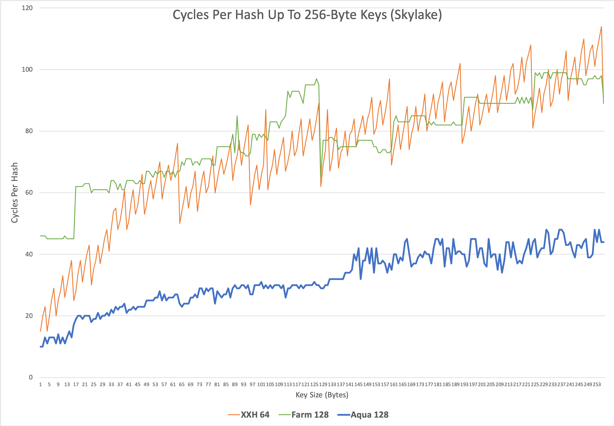

# AquaHash: Fast Hashing With AES Intrinsics

AquaHash is a 128-bit non-cryptographic hash function that delivers state-of-the-art performance across all key sizes. The algorithm employs a novel construction based on widely available AES intrinsics. More details of its design can be [found here](http://www.jandrewrogers.com/2019/03/06/aquahash/). The source is released under Apache License v2.0.

## Performance

AquaHash substantially [outperforms most common hash functions at all key sizes on recent CPUs](benchmark.md). Bulk hashing performance is an exceptional 15 bytes/cycle. Small key performance is nearly twice that of other modern small key algorithms.

The performance graph below includes xxhash64 and Google's FarmHash for reference, popular algorithms optimized for small keys and large keys respectively. Intel’s Skylake microarchitecture was used to measure all algorithms.



Some reduction in relative performance is expected on older CPUs with slower AES intrinsics but should remain competitive due to the large differences in baseline performance.

## Usage

The source is implemented as a single C++ header file "aquahash.h". Both incremental and non-incremental algorithm implementations are included. When use cases allow, it is preferable to use the non-incremental implementation because it will be significantly faster than incrementally constructing the hash.

### Non-Incremental Hashing

```
__m128i hash = AquaHash::Hash(uint8_t * key, size_t bytes, __m128i seed = _mm_setzero_si128());
```

### Incremental Hashing

```
AquaHash aqua(__m128i seed = _mm_setzero_si128());
aqua.Update(uint8_t * key, size_t bytes);
...
aqua.Update(uint8_t * key, size_t bytes);
__m128i hash = aqua.Finalize();
```

The incremental object can be re-initialized at any time using:

```
aqua.Initialize(__m128i seed = _mm_setzero_si128());
```

### Component Algorithms

AquaHash is a composite of two general purpose hashing algorithms that were designed separately, optimized for large keys and small keys respectively. These are included for reference and fully functional for all key sizes:

```
__m128i hash = AquaHash::SmallKeyAlgorithm(uint8_t * key, size_t bytes, __m128i seed = _mm_setzero_si128());
__m128i hash = AquaHash::LargeKeyAlgorithm(uint8_t * key, size_t bytes, __m128i seed = _mm_setzero_si128());
```

## Current Status

**2019-03-06** Initial v1.0 release of the algorithm source code. Includes both incremental and non-incremental implementations, as well as reference implementations of the underlying large key and small key component algorithms. Test vectors and an implementation verification method are included.

**2019-08-11** Refactor aquahash.h, fix all compilation errors for GNU gcc, create benchmarks and unit tests, add aquahash command, and add interface classes for STL.
