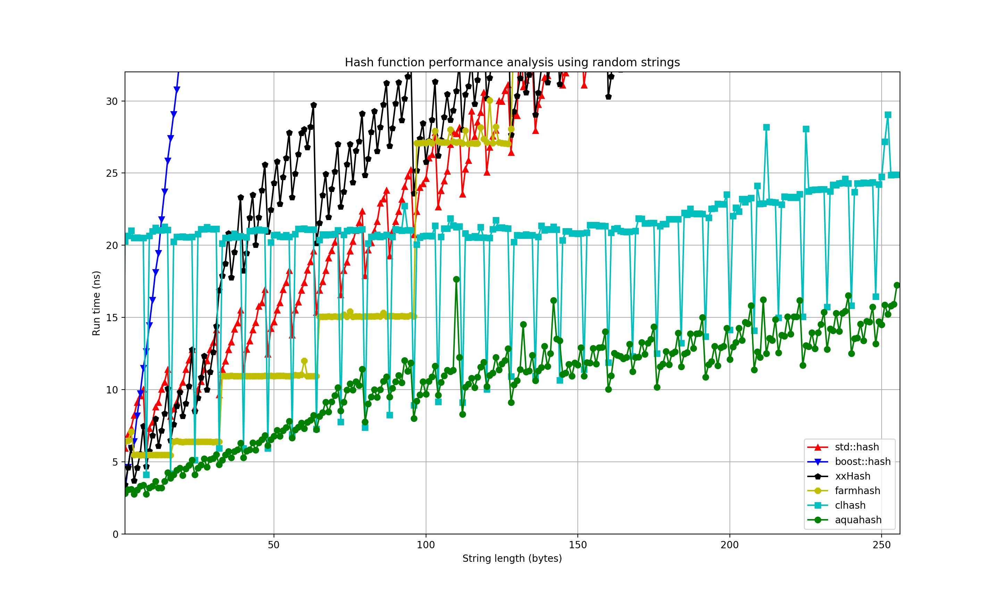
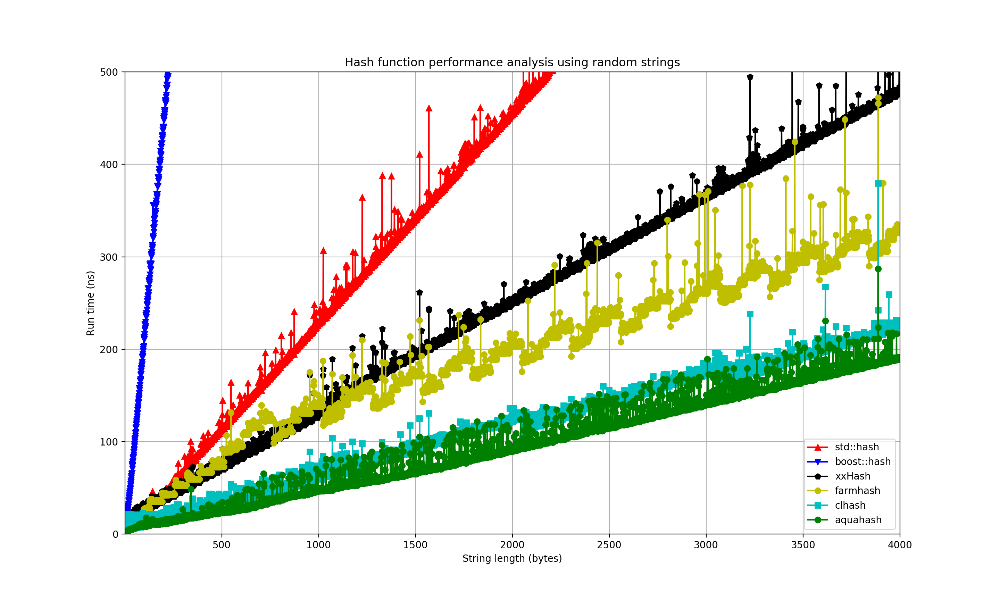
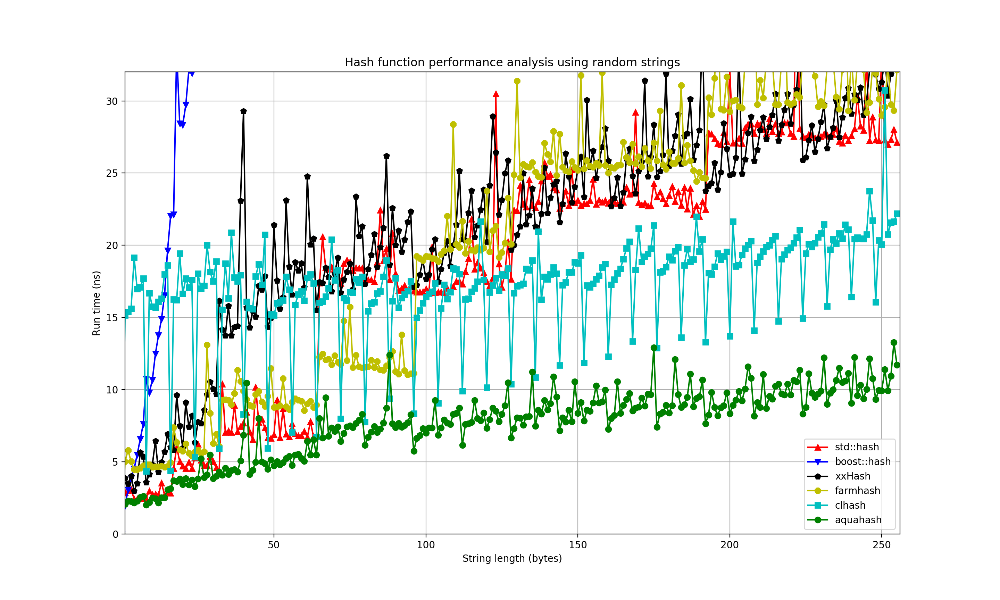
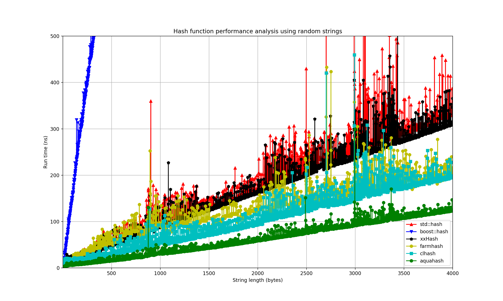

# Introduction #

# How to #

### Compile the benchmark code ###

I have a hard time compile the code using GNU gcc, try clang if you do not want to see [misterious error messages](https://github.com/jandrewrogers/AquaHash/issues/1).

**Download the source code**

``` shell
git clone https://github.com/hungptit/AquaHash.git
```

**Compile all required libraries and binaries**

``` shell
cd AquaHash
./build.sh
```

**Plot the results**

``` shell
./plot_benchmark_results.py data/Darwin/string/data_ 4000 500
```

# Experiment setup #

## Test environments ##

### Linux ###

**CPU**
``` shell
Run on (88 X 2200.08 MHz CPU s)
CPU Caches:
  L1 Data 32K (x44)
  L1 Instruction 32K (x44)
  L2 Unified 256K (x44)
  L3 Unified 56320K (x2)
```

**Compiler**: clang-8.0.0

### MacOS ###

**CPU**

``` shell
Run on (8 X 2200 MHz CPU s)
CPU Caches:
  L1 Data 32K (x4)
  L1 Instruction 32K (x4)
  L2 Unified 262K (x4)
  L3 Unified 6291K (x1)
```

**Compiler**: clang-8.0.0

## Test data ##

### Hash functions ###

This benchmark will generate a random string then collect the performance benchmark results for each hash functions. The output data will be stored in JSON format. 

### Hash table ###

This benchmark will use a hash table to construct a hash set from randomly generated strings.

# Results #

## Linux ##

**Short string benchmarks**

 

**Large string benchmarks**

 

## MacOS ##

**Short string benchmarks**

 

**Large string benchmarks**

 

<!-- ## Window Linux Subsystem ## -->

<!-- **Short string benchmarks** -->

<!--   -->

<!-- **Large string benchmarks** -->

<!--   -->

# Analysis #

## Usability ##

* farmhash is the worse in-term of usability. We cannot compile farmhash using provided configure script and have to use it as a header only library.
* aquahash is not compilable using GNU gcc and users must use clang to compile AquaHash code.
* std::hash does not take raw pointers and length. We need to use std::string when comparing the performance of all studied hash functions.

## General observations ##

* The performance of all hash functions is consistent in all platforms.
* AquaHash is the fastest hash function in all of our benchmarks. We should use this hash function for performance critical applications if possible.
* clhash starts to shine when the string size if greater than or equal to 96 bytes.
* farmhash also has a very good performance for both small and large string.
* std::hash has a reasonable performance.
* boost::hash function is really slow and we should not use it in performance critical applications.

## Short string benchmark ##

* AquaHash is the best hash function i.e it is faster than all studied hash functions in all runs. This hash function can process about 6 bytes/cycle on average.
* boost::hash is the worse hash function and its run-time seem to be quadratic to the size of the string.
* clhash has very high overhead for small strings and it starts to catch up with farmhash when the string size is greater than or equal to 96 bytes.  
* xxHash is not faster than std::hash for small strings. 

## Large string benchmark ##

* AquaHash is still the fastest hash function. It can process 15 bytes/cycle.
* clhash is the second best hash function and its hashing speed is about 9 bytes/cycle.
* farmhash also has a very good performance. Our performance benchmark shows that farmhash can process 8-9 bytes/cycle.
* boost::hash is again the worse hash function. We should not use boost::hash if possible.
